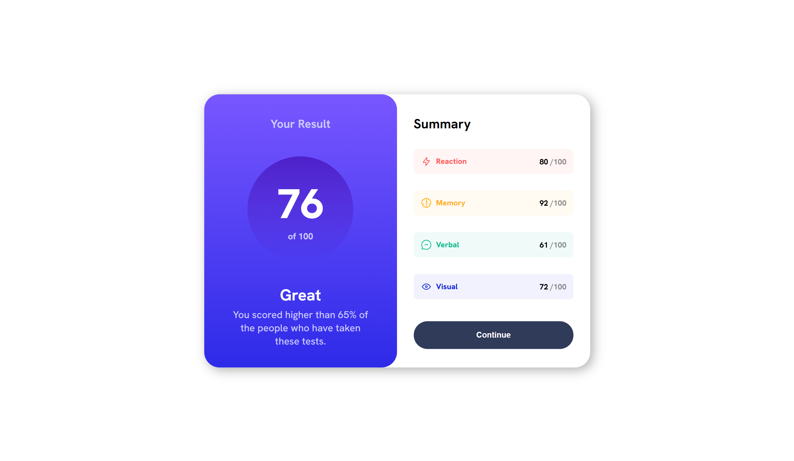

# Frontend Mentor - Results summary component solution

This is a solution to the [Results summary component challenge on Frontend Mentor](https://www.frontendmentor.io/challenges/results-summary-component-CE_K6s0maV). Frontend Mentor challenges help you improve your coding skills by building realistic projects.

## Overview

### The challenge

Users should be able to:

- View the optimal layout for the interface depending on their device's screen size
- See hover and focus states for all interactive elements on the page
- **Bonus**: Use the local JSON data to dynamically populate the content

### Screenshot

### Links

- Live Site URL: [Add live site URL here](https://results-summary-jesuscodes.netlify.app)

## My process

### Built with

- Semantic HTML5 markup
- CSS custom properties
- Flexbox
- CSS Grid
- Mobile-first workflow
- Vanilla JavaScipt

### What I learned

I learned or well I would re-practice what CSS styles and promises with Javascript and rendering in this language were.

## Author

- Website - [Jesus.Codes](https://jesusbernaldev.tech)
- Frontend Mentor - [@JesusBernal2020](https://www.frontendmentor.io/profile/JesusBernal2020)

## Acknowledgments

I thank frontenmentor for providing these spaces and projects so that all programmers can continue practicing and advancing in this field.
